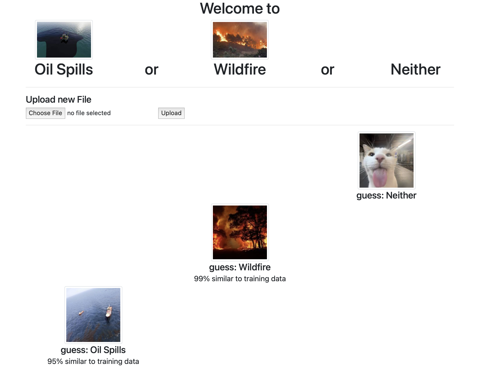
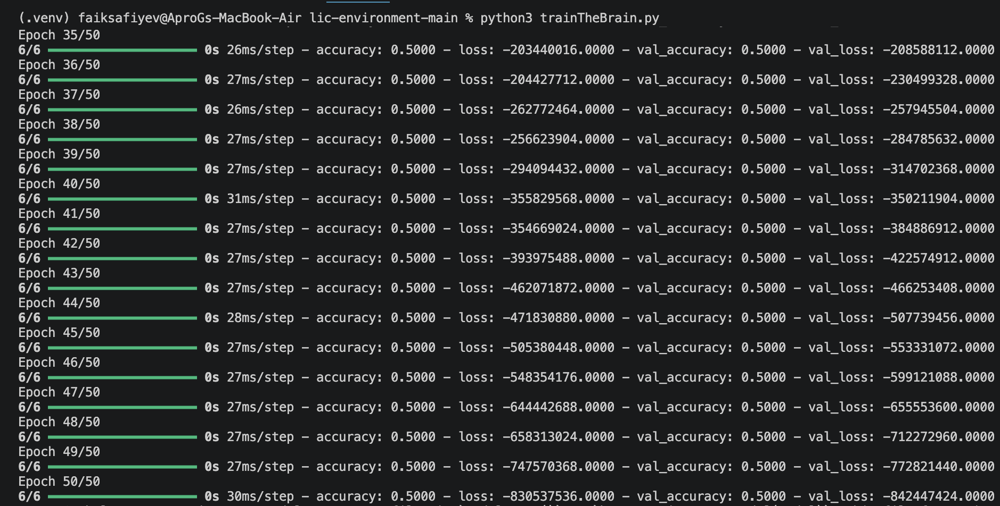
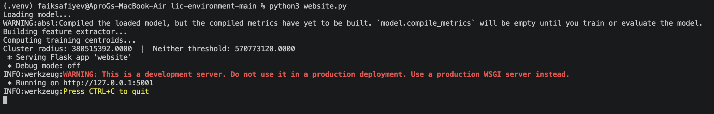

# lic-environment

A Flask web app that classifies drone images as an oil spill, a wildfire, or neither — using a custom-trained CNN with a feature extractor and cluster-based similarity scoring. Upload an image and get an instant prediction with a confidence percentage. Every upload is saved to continuously expand the training dataset.

---

## Demo

**Web interface** — upload any image and get a labeled prediction with similarity score:



**Training output:**



**Starting the server:**



---

## How it works

**Model (`trainTheBrain.py`)** — a binary CNN built with Keras: three Conv2D + MaxPooling blocks, a Dense layer with 0.5 Dropout, and a sigmoid output. Trained on images in `train/` and validated against `validation/`, then saved as `saved_model.h5`.

**"Neither" detection** — on startup, `website.py` builds a feature extractor from the trained model and computes cluster centroids over the training data. Incoming images are embedded and compared against these centroids; if the distance exceeds a threshold, the image is classified as "Neither" rather than forcing a false positive.

**Similarity score** — each prediction includes a percentage indicating how closely the uploaded image matches the training data distribution.

**Data flywheel** — all uploaded images are stored in `static/uploads/`, building up a dataset for future retraining.

---

## Stack

Python · Flask · TensorFlow / Keras · NumPy · Pillow

---

## Running

**1. Prepare your dataset**

```
train/
  OilSpills/
  Wildfire/
validation/
  OilSpills/
  Wildfire/
```

> For better model performance, use a large and diverse dataset. Good sources: [Kaggle wildfire datasets](https://www.kaggle.com/search?q=wildfire), [oil spill satellite imagery](https://www.kaggle.com/search?q=oil+spill+detection). The more images per class, the more reliable the predictions.

**2. Train the model:**

```bash
python trainTheBrain.py
```

**3. Launch the web app:**

```bash
python website.py
```

Open `http://localhost:5001`, upload a drone image, and get a prediction.

---

## Built by

[Faig Safiyev](https://github.com/Apr0G) & [n1chey](https://github.com/n1chey)
